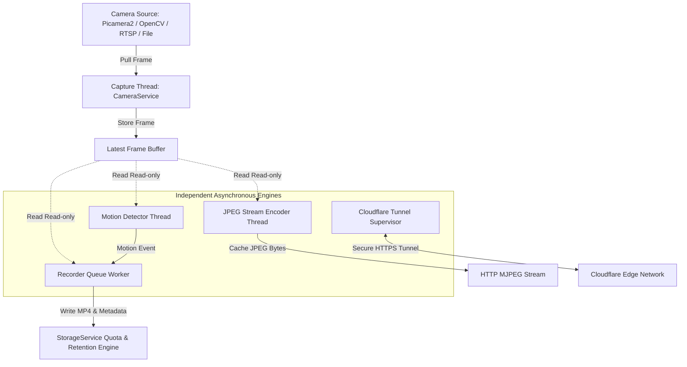

# CAMZ: Next-Gen Camera Streaming & Surveillance Platform

[](https://github.com/yourusername/CAMZ/actions/workflows/ci.yml)
[](https://opensource.org/licenses/MIT)
[](CHANGELOG.md)

CAMZ is a lightweight, low-latency, production-grade camera streaming, motion recording, and remote access surveillance platform. Built for Raspberry Pi OS, Linux, macOS, and Windows, CAMZ decouples camera feed acquisition, motion detection, web streaming, automated disk-quota recording, and Cloudflare Tunneling into discrete asynchronous pipelines.

---

## 🏗️ Architecture Overview



---

## 🌟 Key Features

- **Decoupled Asynchronous Engines**: Capture, motion analysis, JPEG streaming, and video recording execute on independent worker threads. Disk write latency never impacts live stream performance.
- **Unified Camera Factory (`create_camera`)**: Single source of truth for camera initialization across runtime, CLI diagnostics, benchmarking, and tests. Supports Picamera2 (Raspberry Pi CSI), OpenCV (USB webcams), RTSP IP streams, and virtual file looping.
- **Micro-Buffered Motion Recording**: Circular pre-buffers (defaults to 5s) and post-buffers (defaults to 10s) ensure complete motion event capture without fragmentation.
- **Recording Management**: Interactive React SPA dashboard with card selection, `Shift-click` range multi-select, bulk delete API (`DELETE /recordings/bulk`), delete all API (`DELETE /recordings/all`), and typed safety confirmation modals.
- **Native Cloudflare Tunnels**: Integrated `TunnelService` featuring automated `cloudflared` binary installation, TryCloudflare quick sharing (`camz share`) with inline terminal ASCII QR codes, state machine supervision, and QUIC → HTTP/2 protocol fallback.
- **Aesthetic React SPA Dashboard**: Modern Vercel/Linear-inspired dark interface with live system telemetry, system log viewer, settings manager, and interactive video player.
- **Automated Storage Quotas & Age Retention**: Thread-safe storage engine automatically sweeps oldest recordings when storage quotas or age retention limits are reached.
- **Comprehensive CLI & Diagnostics**: Unified `./camz` CLI featuring `start`, `stop`, `restart`, `status`, `info`, `doctor`, `share`, `verify`, `benchmark`, `clean`, and `tunnel` management commands.

---

## 📚 Documentation Index

- [Architecture Overview](docs/ARCHITECTURE.md)
- [Installation Guide](docs/INSTALL.md)
- [Configuration Reference](docs/CONFIGURATION.md)
- [CLI Reference](docs/CLI.md)
- [REST API Reference](docs/API.md)
- [Recording Management](docs/RECORDING_MANAGEMENT.md)
- [Cloudflare Tunnel Guide](docs/CLOUDFLARE_TUNNEL.md)
- [Developer Guide](docs/DEVELOPMENT.md)
- [Troubleshooting Guide](docs/TROUBLESHOOTING.md)

---

## 🛠️ Technology Stack

- **Backend**: Python 3.10+, FastAPI (ASGI server), OpenCV, NumPy, Uvicorn, Pillow, psutil, httpx, qrcode.
- **Frontend**: React 19, TypeScript, Vite, TailwindCSS v4, Zustand, Lucide Icons, Recharts, Framer Motion.
- **Tunneling**: `cloudflared` daemon with native state machine supervisor.

---

## 🚀 Quick Start

### 1. Installation
```bash
git clone https://github.com/yourusername/CAMZ.git
cd CAMZ
./setup.sh
```

### 2. Run Server
```bash
./camz start
```
Access the web dashboard at `http://127.0.0.1:8000`.

### 3. Share Remote HTTPS Stream (Cloudflare Quick Tunnel)
```bash
./camz share
```
*Generates a public HTTPS URL, renders an ASCII QR code in the terminal, and copies the URL to your clipboard.*

### 4. Run System Diagnostics
```bash
./camz doctor
```

---

## 📁 Repository Structure

```
CAMZ/
├── backend/                        # Main Python package
│   ├── api/                        # HTTP route handlers
│   ├── camera/                     # Camera acquisition & create_camera factory
│   ├── config/                     # Multi-layered configuration parser
│   ├── detection/                  # OpenCV motion detection engine
│   ├── health/                     # Diagnostics & system metrics reporter
│   ├── metrics/                    # FPS & latency counters
│   ├── recording/                  # Pre/post buffer recorder worker & encoder
│   ├── storage/                    # Storage quota & directory manager
│   ├── utils/                      # Event bus, logging, recovery & state machine
│   ├── cli.py                      # Unified CLI entry point
│   ├── main.py                     # FastAPI application entry point
│   ├── services.py                 # ServiceManager dependency container
│   ├── tunnel_state.py             # Tunnel state machine
│   └── tunnel_validator.py         # Connectivity health validator
├── docs/                           # Documentation suite
│   ├── ARCHITECTURE.md             # System architecture & diagrams
│   ├── INSTALL.md                  # OS & platform installation guide
│   ├── CONFIGURATION.md            # Settings & environment variables reference
│   ├── CLI.md                      # CLI command reference
│   ├── API.md                      # REST API endpoint reference
│   ├── RECORDING_MANAGEMENT.md     # Multi-select, bulk delete & retention
│   ├── CLOUDFLARE_TUNNEL.md        # Cloudflare tunnel architecture & usage
│   ├── DEVELOPMENT.md              # Local development & testing guide
│   └── TROUBLESHOOTING.md          # Diagnostic hints & hardware fixes
├── frontend/                       # React SPA dashboard (Vite + TS + Tailwind v4)
├── runtime/                        # Dynamic runtime data (git-ignored)
│   ├── logs/                       # Application log files
│   ├── recordings/                 # Saved MP4 video files + metadata JSON
│   ├── snapshots/                  # Saved JPEG snapshots
│   └── settings.json               # Persisted user settings
├── scripts/                        # Benchmark, endurance & platform scripts
├── tests/                          # Pytest test suite (82 unit/integration tests)
├── camz                            # Shell launcher script
├── setup.sh / setup.ps1            # Platform installer scripts
├── run.sh / run.ps1                # Platform launch wrappers
├── verify.sh / verify.ps1          # CI verification wrappers
└── docker-compose.yml              # Docker container composition
```

---

## 🛡️ License

CAMZ is open-source software licensed under the [MIT License](LICENSE).
