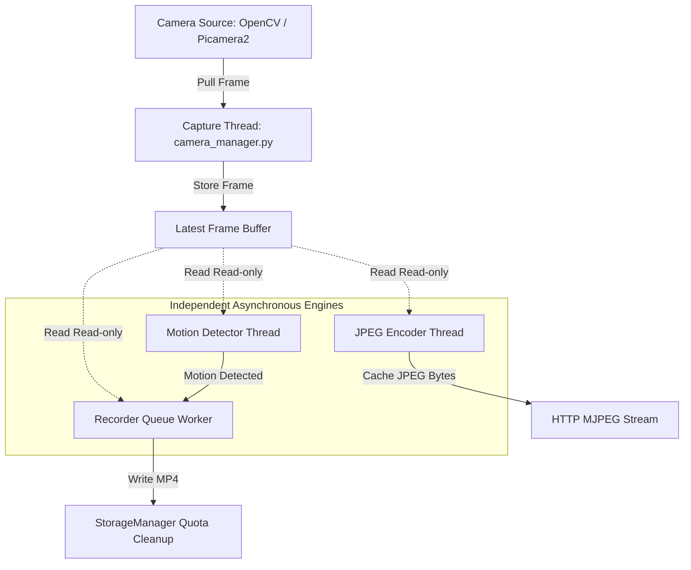
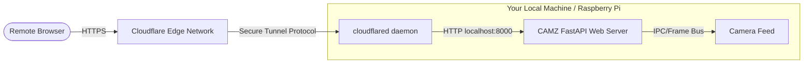

# CAMZ: Next-Gen Surveillance System

[](https://github.com/yourusername/CAMZ/actions/workflows/ci.yml)
[](https://opensource.org/licenses/MIT)

CAMZ is a lightweight, low-latency, cross-platform open-source camera dashboard and video surveillance system. Designed to run efficiently on everything from a Raspberry Pi OS setup to macOS, Linux, and Windows 10/11 desktops, CAMZ decouples camera feed acquisition, motion detection, web streaming, and automated disk-quota recording into discrete asynchronous pipelines.

---

## 🏗️ Architecture Overview



---

## 🌟 Key Features

- **Decoupled Pipelines**: Capture, motion analysis, streaming, and recording run on separate threads. Slow disk operations never block live streams.
- **Micro-Buffered Recording**: Circular pre-buffers (defaults to 5s) and post-buffers (defaults to 10s) ensure you never miss the start or end of motion events.
- **Aesthetic Dashboard**: Premium Vercel/Linear-inspired interface featuring live system load graphs, scrolling log console, settings validators, and interactive video playback.
- **Dynamic Quotas**: Intelligent storage limits controller automatically sweeps old recordings oldest-first when disk threshold is hit.
- **Cross-Platform Setup**: Unified bootstrap utilities for Windows (PowerShell) and Linux/macOS (Bash).
- **Graceful Failbacks**: Automatically detects Picamera2, video sources, hardware encoders, and reverts to stable software/OpenCV fallbacks if absent.

---

## 🛠️ Technology Stack

- **Backend**: Python 3.10+, FastAPI (ASGI server), OpenCV, NumPy, Uvicorn, Pillow, psutil.
- **Frontend**: React 19, TypeScript, Vite, TailwindCSS v4, Zustand (state store), React Router v7, Recharts, Framer Motion, Lucide Icons.

---

## 💻 Installation

CAMZ provides automatic capability checking. It will detect your platform configurations and hardware constraints automatically.

### Platform-Specific Quick Install

#### 1. Linux & macOS
Open your terminal and run the one-command installer:
```bash
./setup.sh
```
This script provisions the Python virtual environment (`.venv`), installs all dependency wheels, runs platform diagnostics, installs frontend assets, and pre-compiles the React production bundle under `frontend/dist`.

#### 2. Windows 10 & 11
Open PowerShell as an Administrator and execute:
```powershell
Set-ExecutionPolicy RemoteSigned -Scope Process
.\setup.ps1
```

#### 3. Raspberry Pi OS (Picamera2 support)
If using the official Raspberry Pi camera, install system packages first:
```bash
sudo apt install -y python3-picamera2 libcamera-apps
./setup.sh
```

---

## 🚀 Running the Project

To start the system, run the bootstrap script corresponding to your platform.

### Linux / macOS
```bash
./run.sh
```

### Windows
```powershell
.\run.ps1
```

This starts the ASGI Uvicorn app. Open `http://127.0.0.1:8000` in your web browser.

---

## ⚙️ Configuration & Environment Variables

CAMZ reads configuration options from standard environment variables (or local `.env` files).

| Variable | Default | Description |
| -------- | ------- | ----------- |
| `CAMZ_CAMERA_INDEX` | `0` | Default camera device index (OpenCV). |
| `CAMZ_USE_PICAMERA2` | `0` | Force Picamera2 source on Raspberry Pi. |
| `CAMZ_STREAM_FPS` | `20` | Streaming frame rate target (FastAPI proxy). |
| `CAMZ_RECORDING_FPS` | `20` | Video writer recording output frame rate. |
| `CAMZ_STORAGE_LIMIT_GB` | `50` | Maximum disk storage usage allowed for recordings. |
| `CAMZ_RETENTION_DAYS` | `30` | Age cutoff in days to retain recording files. |
| `CAMZ_PREBUFFER_SECONDS` | `5` | Pre-motion buffer duration in seconds. |
| `CAMZ_POSTBUFFER_SECONDS` | `10` | Post-motion recording cooldown duration. |

---

## ☁️ Cloudflare Tunnel Integration

CAMZ features native, production-grade Cloudflare Tunnel support to securely expose your camera streaming feed and dashboard interface over a public HTTPS URL without port-forwarding or local firewall adjustments.

### 📐 Tunnel Architecture



### 🚀 Quick Start (TryCloudflare)

To instantly expose your local CAMZ installation to a random public HTTPS subdomain (ideal for testing or temporary remote monitoring), simply run:
```bash
./camz share
```
This command automatically:
1. Detects if the CAMZ server is running (starts it in the background if offline).
2. Spawns and supervises the `cloudflared` tunnel process.
3. Retrieves the secure URL (`https://*.trycloudflare.com`).
4. Renders an interactive ASCII QR Code in the terminal.
5. Copies the URL to your system clipboard.

### 🛠️ CLI Operations

You can control and query the tunnel supervisor service directly from the command line:
* `camz tunnel start` - Start the background tunnel.
* `camz tunnel stop` - Stop the active tunnel.
* `camz tunnel restart` - Trigger a service restart.
* `camz tunnel status` - View uptime, latency, and crash telemetry.
* `camz tunnel logs` - Scan recent daemon logs.

### ⚙️ Production Configuration (Named Tunnels)

For permanent setups using your own custom domain, configure the `[tunnel]` section in your `config.toml`:

```toml
[tunnel]
enabled = true
provider = "cloudflare"
autostart = true               # Start tunnel automatically on server boot
install_if_missing = true      # Install cloudflared automatically via apt/pacman/dnf
share_localhost = "http://127.0.0.1:8000"
quick_tunnel = false           # Set to false for custom domains
hostname = "camz.yourdomain.com"
token = "your-cloudflare-tunnel-token-here"
```

If `token` is specified, `cloudflared` runs as a Named Tunnel using your credential tokens. Keep `quick_tunnel = true` and `token = ""` to default to temporary TryCloudflare tunnels.

---

## 📁 Repository Structure

```
CAMZ/
├── backend/                        # Python backend package
│   ├── main.py                     # FastAPI application entry point
│   ├── api/                        # HTTP route handlers (stream.py)
│   ├── camera/                     # Camera acquisition layer
│   │   ├── camera.py               # OpenCV / Picamera2 device wrapper
│   │   └── camera_manager.py       # Capture thread, latest-frame buffer
│   ├── config/                     # System configuration
│   │   └── config.py               # Environment variable reader
│   ├── detection/                  # Motion analysis
│   │   └── detector.py             # OpenCV-based motion detector
│   ├── health/                     # Subsystem health reporting
│   │   └── health.py               # Build health report utility
│   ├── metrics/                    # Performance counters
│   │   └── metrics.py              # FPS counter, uptime tracker
│   ├── recording/                  # Async recording pipeline
│   │   ├── recorder.py             # Queue-worker, pre/post-buffer engine
│   │   ├── recording_manager.py    # Session, metadata & thumbnail writer
│   │   └── video_encoder.py        # OpenCV VideoWriter wrapper
│   ├── storage/                    # Disk management
│   │   └── storage_manager.py      # Quota enforcement + RuntimeStorageManager
│   └── utils/                      # Shared utilities
│       └── utils.py                # Logging bootstrap, directory setup
├── frontend/                       # React SPA (Vite + TypeScript + Tailwind v4)
│   ├── src/
│   │   ├── components/             # Layout components (Sidebar, TopBar, etc.)
│   │   ├── pages/                  # Route pages (Dashboard, LiveView, etc.)
│   │   └── store/                  # Zustand global state
│   └── dist/                       # Compiled production bundle (git-ignored)
├── runtime/                        # All generated data (git-ignored)
│   ├── recordings/                 # MP4 video files + JSON metadata
│   ├── snapshots/                  # Captured JPEG snapshots
│   ├── logs/                       # Application log files
│   ├── cache/                      # Internal caching layer
│   └── settings.json               # Persisted user settings
├── static/                         # Legacy static assets
├── templates/                      # Jinja2 HTML templates (fallback)
├── tests/                          # Pytest unit and integration tests
├── scripts/                        # Benchmark, endurance, and platform tools
├── run.sh / run.ps1                # Platform launch scripts
├── setup.sh / setup.ps1            # Platform install scripts
└── verify.sh / verify.ps1          # CI verification scripts
```

---

## 🔌 REST API Endpoints

- `GET /`: Serves the React SPA Dashboard index.
- `GET /snapshot`: Captures and returns a unique timestamped JPEG.
- `GET /stream.mjpeg`: Dynamic MJPEG video feed.
- `GET /health`: Detailed subsystem diagnostic report.
- `GET /recordings`: JSON list of saved recording sessions.
- `GET /recordings/{id}`: Serve the recording MP4 file.
- `DELETE /recordings/{id}`: Permanently delete a recording.
- `GET /storage`: Current quota usage and limits report.
- `GET /settings`: Fetch dashboard settings.
- `POST /settings`: Dynamic configuration updates (saves to `settings.json`).
- `GET /logs`: Tail logs buffer.
- `POST /camera/restart`: Reload and restart camera capture feed.

---

## 🛡️ License

This project is open-source and licensed under the [MIT License](LICENSE).
