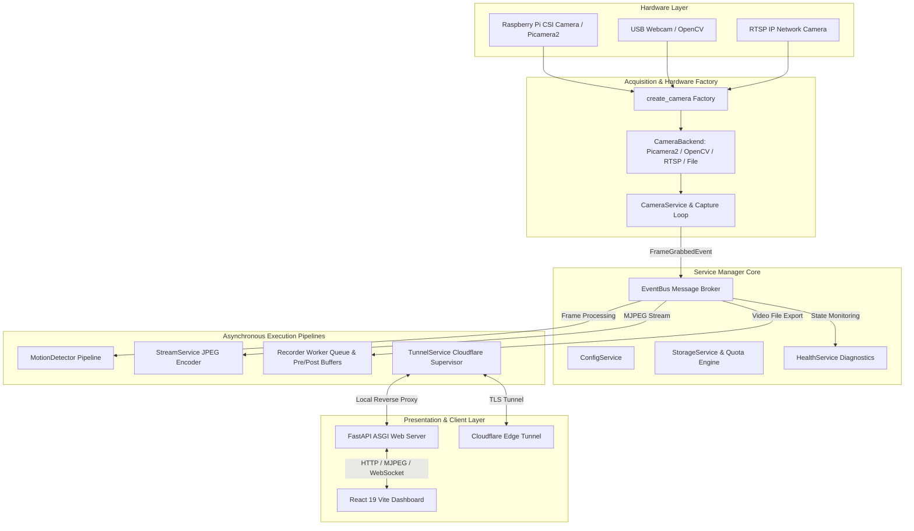

# CAMZ System Architecture

CAMZ is designed as an asynchronous, event-driven surveillance and camera streaming platform. It decouples video acquisition, frame processing, motion analysis, web streaming, and automated recording to achieve high throughput, low latency, and zero frame drops on resource-constrained devices like the Raspberry Pi.

---

## High-Level Architecture Diagram

---

## Core Components

### 1. Unified Camera Factory (`create_camera`)
- Located in `backend/camera/camera.py` and `backend/camera/camera_backend.py`.
- Serves as the **single source of truth** for camera initialization across runtime, CLI (`camz verify`, `camz benchmark`), diagnostics (`camz doctor`), and test suites.
- Supports four pluggable backends:
  1. `Picamera2Backend`: Native libcamera driver for Raspberry Pi Camera Modules (v1, v2, v3, HQ, GS).
  2. `OpenCVBackend`: Standard V4L2 USB webcams and video capture devices (`/dev/video*`).
  3. `RTSPBackend`: IP security camera feeds over RTSP/RTMP with low-latency FFMPEG transport parameters.
  4. `FileBackend`: Virtual camera looping from pre-recorded MP4/AVI files for automated testing and CI.

### 2. Service Manager Lifecycle (`ServiceManager`)
- Located in `backend/services.py`.
- Controls service registration, initialization, dependency injection, and deterministic shutdown.
- Managed services include:
  - `ConfigService`: Manages environment variables, `config.toml`, and dynamic `settings.json` overlays.
  - `CameraService`: Manages frame capture loop, hardware failure recovery, and event emission.
  - `StreamService`: Manages live JPEG encoding, client tracking, and latency calculations.
  - `RecordingService`: Coordinates pre-motion buffer, motion triggers, post-motion cooldown, and MP4 generation.
  - `StorageService`: Manages storage quotas (`limit_bytes`), retention age cleanup (`retention_days`), and thread-safe file deletion.
  - `HealthService`: Aggregates CPU, RAM, disk, temperature, FPS, and diagnostic health score metrics.
  - `TunnelService`: Manages the Cloudflare Tunnel lifecycle, installer, supervisor thread, and health validator.

### 3. Asynchronous Event Bus (`EventBus`)
- Located in `backend/utils/event_bus.py`.
- Thread-safe publish-subscribe event broker decoupling pipeline execution.
- Key events:
  - `FrameGrabbedEvent`: Emitted when a new frame is acquired by `CameraService`.
  - `FrameAnalyzedEvent`: Emitted after motion analysis is performed.
  - `MotionDetectedEvent`: Emitted when motion exceeding threshold contour area is detected.
  - `RecordingStartedEvent` / `RecordingStoppedEvent`: Emitted when session recording begins/ends.
  - `TunnelStateChangedEvent`: Emitted on Cloudflare Tunnel state transitions.

### 4. Cloudflare Tunnel Supervisor (`TunnelService`)
- Located in `backend/services.py`, `backend/tunnel_state.py`, and `backend/tunnel_validator.py`.
- Governed by an explicit finite state machine:
  `STOPPED` → `INSTALLING` → `STARTING` → `CONNECTING` → `CONNECTED` ↔ `DEGRADED` → `STOPPING` → `STOPPED` (or `FAILED` with backoff retry).
- Features automatic architecture detection (`amd64`, `arm64`, `armhf`), auto-installation via OS package managers (`apt`, `pacman`, `dnf`), exponential backoff restart, QUIC to HTTP/2 protocol fallback, and health validation before URL exposure.

### 5. Storage Quota & Recording Engine (`StorageService`, `Recorder`)
- Located in `backend/recording/recorder.py` and `backend/services.py`.
- Uses a circular pre-motion buffer (deque) to capture seconds prior to motion detection.
- Post-motion cooldown timer keeps recording until motion ceases.
- `StorageService` serializes filesystem cleanup using `threading.RLock()` to ensure non-blocking, thread-safe session deletion and age/disk quota enforcement.
