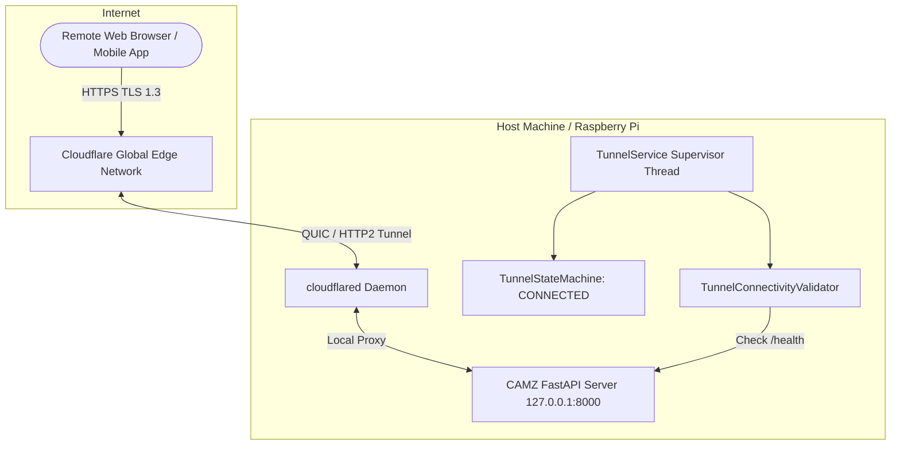

# Cloudflare Tunnel Integration Guide

CAMZ features native, production-grade Cloudflare Tunnel support managed by `TunnelService`. This allows exposing your camera streams, web dashboard, and API endpoints securely over an encrypted HTTPS URL without port-forwarding, static public IPs, or firewall modifications.

---

## Architecture Diagram



---

## Features

### 1. TryCloudflare Quick Tunnels
- One-command sharing via `./camz share`.
- Generates a temporary secure HTTPS URL (`https://*.trycloudflare.com`).
- Displays an interactive ASCII QR code directly in the terminal for quick mobile scanning.
- Copies the public URL to system clipboard automatically.

### 2. Named Tunnels (Custom Domains)
- Configurable via `config.toml` or environment variables for permanent setups.
- Uses Cloudflare Tunnel authentication tokens (`token = "ey..."`).
- Automatically binds your custom subdomain (e.g. `camz.mydomain.com`).

### 3. Architecture-Aware Automatic Installer
- Detects host architecture via `dpkg --print-architecture` (`amd64`, `arm64`, `armhf`).
- Auto-installs `cloudflared` using host package managers (`apt`, `pacman`, `dnf`) if `install_if_missing = true`.

### 4. Exponential Backoff & Protocol Fallback
- State machine tracks connection health (`STOPPED`, `INSTALLING`, `STARTING`, `CONNECTING`, `CONNECTED`, `DEGRADED`, `FAILED`).
- Automatically retries connection failures using exponential backoff with configurable max retries.
- If QUIC (UDP 7844) connections fail due to outbound firewall restrictions, automatically falls back to HTTP/2 over TCP 443.

---

## Configuration Reference

Add or modify the `[tunnel]` section in `config.toml`:

```toml
[tunnel]
enabled = true
provider = "cloudflare"
autostart = true
install_if_missing = true
share_localhost = "http://127.0.0.1:8000"
quick_tunnel = true             # Set false for Named Tunnels
hostname = "camz.mydomain.com"  # Custom domain
token = ""                      # Tunnel token for Named Tunnel
protocol = "auto"               # 'auto', 'quic', or 'http2'
max_retries = 10
validation_timeout_seconds = 15.0
quic_fail_threshold = 3
```

---

## CLI Control Commands

- `./camz share` — Instantly start tunnel and show QR code.
- `./camz tunnel start` — Start tunnel background service.
- `./camz tunnel stop` — Stop active tunnel.
- `./camz tunnel restart` — Trigger tunnel restart.
- `./camz tunnel status` — View connection state, protocol, and public URL.
- `./camz tunnel logs` — Scan recent daemon logs.
- `./camz doctor` — Run 9 automated network and tunnel diagnostic checks.
