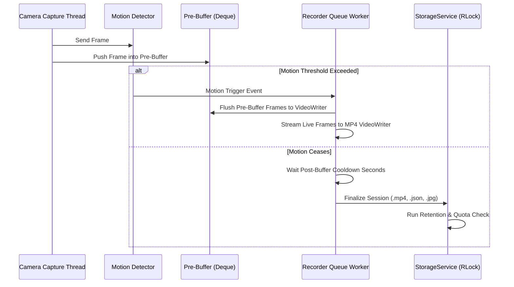

# CAMZ Recording Management System

CAMZ features an automated, thread-safe recording management architecture designed for high-reliability surveillance operations.

---

## Recording Pipeline Architecture

---

## Key Features

### 1. Micro-Buffered Recording (Pre-Buffer & Post-Buffer)
- **Pre-Buffer**: Retains pre-motion frames in a sliding deque buffer (default: 5 seconds). When motion occurs, pre-motion frames are prepended to the recording so the beginning of the incident is captured.
- **Post-Buffer**: Keeps writing frames for a configurable cooldown window (default: 10 seconds) after motion stops, preventing video fragmentation.

### 2. Multi-Select Dashboard UX
The web UI (`frontend/src/pages/Recordings.tsx`) allows interactive selection and batch management:
- **Checkbox Toggle**: Click card checkboxes or cards to select individual recordings.
- **Shift-Click Range**: Select contiguous ranges of recordings with `Shift + Click`.
- **Select All**: Toggle select/deselect for all recordings currently matching search/sort filters.
- **Counter Badge**: Real-time counter displaying selected item count.

### 3. Bulk & All Deletion
- **Bulk Delete (`DELETE /recordings/bulk`)**: Accepts a list of recording IDs, deletes matching `.mp4`, `.json`, and `.jpg` files from disk, prunes empty date subdirectories, and returns partial failure metrics if an individual file deletion fails.
- **Delete All (`DELETE /recordings/all`)**: Requires explicit typing of `DELETE` in the confirmation modal before executing full disk cleanup, returning total sessions removed and storage freed in bytes (`freed_bytes`).

### 4. Automated Disk Quotas & Age Retention
- **Storage Quota (`CAMZ_STORAGE_LIMIT_GB`)**: Enforces disk quotas (e.g. 50 GB). When total recording directory size exceeds limit, oldest sessions are unlinked iteratively until usage drops below threshold.
- **Age Retention (`CAMZ_RETENTION_DAYS`)**: Automatically purges recordings older than the retention cutoff (e.g. 30 days).
- **Thread Safety**: All storage operations are protected by `threading.RLock()` to prevent race conditions during concurrent HTTP deletion requests and background quota cleanup loops.
